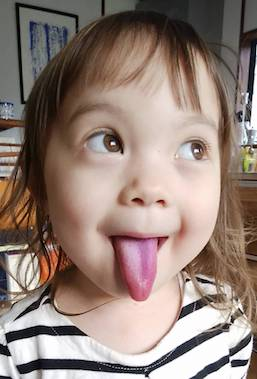

Teacher Colin is a former research professor. He studied at the University of Cambridge and Leeds University, and worked at the University of Oxford, the Université de Rennes (France), and Columbia University in New York City, with study visits to CNR/IRPI Perugia, National Taiwan University (Taipei), and the University of Tokyo.

This is not a photo of him. He is a rather older than that.

Here are some news items in Japanese about Colin's research work:

 [CNN op-ed about the Haiti earthquake](https://blog.goo.ne.jp/geomorgis/e/73c2de60b5ea6b788e9d5bb9cb81a25e)
 
 [Blog item about his work on detecting huge landslides using novel techniques](http://gis-landslide.blogspot.com/2010/11/2gis-landslide.html?m=1)
